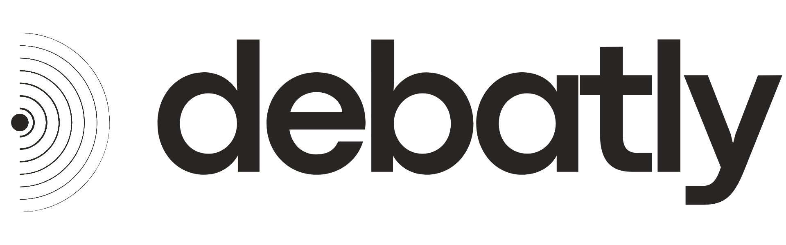

<div align="center">

<picture>
  <source media="(prefers-color-scheme: dark)" srcset="docs/debatly-logo-white.png">
  <source media="(prefers-color-scheme: light)" srcset="docs/debatly-logo-black.png">
  
</picture>

### Watch any debate. See who's actually telling the truth.

**Debatly** listens to a live debate (or an uploaded recording), transcribes it with per-speaker labels, fact-checks the claims against the web, tracks contradictions, and turns it all into a clear **credibility score** and a readable post-debate report — no winner declared, just the facts and an honest reading.

<br/>


</div>

---

## 🎬 Demo

<video src="https://github.com/majortom-39/debatly/raw/main/docs/demo.mp4" controls width="100%"></video>

> If the player doesn't load above, **[▶ watch the demo here](https://github.com/majortom-39/debatly/raw/main/docs/demo.mp4)**.

---

## ✨ What it does

- **🎙️ Live capture** — Streams your microphone to the server over a WebSocket and transcribes it in real time with speaker diarization, so you can see who said what as the debate happens.
- **📁 Import a recording** — Upload an audio/video file or paste a video URL. Debatly extracts the audio, diarizes and transcribes the whole thing, then runs it through the exact same analysis pipeline as a live debate.
- **🧠 Live Debate Desk** — As people talk, the app builds the board:
  - **Debate points** grouped into themed, collapsible families per side.
  - **Claims & fact-checks** with a verdict (Verified / False / Misleading / Unverified), a one-line reason, and real sources.
  - **Self-contradictions & double standards** caught across the debate.
- **⚖️ Credibility score** — A deterministic score that rewards verified claims and penalizes false/misleading ones and self-contradictions, so volume never beats accuracy. It measures honesty, **not** who talked more or whose opinion you like.
- **📊 Post-debate report** — A clean write-up rendered above the transcript:
  - A plain-English verdict (**no winner is declared** — you decide).
  - A **score-over-time chart** with markers for when each speaker entered.
  - A **per-speaker breakdown** with stats, a judging note, and a standout quote.
  - Side summaries, turning points (with gained/lost-ground impact), and the scoring methodology.
- **📄 Native PDF export** — Download the whole report as a proper, text-based PDF with vector charts (selectable text, small file, nothing clipped) — not a screenshot.
- **🔁 Long, uninterrupted sessions** — Built to run for hours without dropping the connection.
- **✉️ Email when ready** — Long imports can run in the background and email you when the report is done.

---

## 🛠️ How it works

```
Browser (mic / upload / URL)
        │  PCM audio over WebSocket  /  file or link
        ▼
Node + Express + ws  ──►  Speechmatics (live STT)   /   pyannote.ai (batch diarize + transcribe)
        │
        ▼
Clean node pipeline
  ├─ Claim Builder         → finds checkable claims (ignores personal anecdotes)
  ├─ Fact Checker          → Firecrawl search → Gemini writes the verdict from real sources
  ├─ Debate-Point Builder  → groups arguments into themed families
  ├─ Inconsistency Watch   → flags self-contradictions & double standards
  ├─ Side Builder          → assigns speakers to sides
  └─ Scoring Engine        → deterministic credibility score per side
        │
        ▼
Supabase (Postgres)  ◄─►  Live Debate Desk + Post-debate Report (React)
```

---

## 🧩 Tech stack

| Layer | Tools |
|---|---|
| **Frontend** | React + TypeScript, Vite, Recharts (charts), Lucide (icons), jsPDF (native PDF export) |
| **Backend** | Node.js, Express, `ws` (WebSocket), Zod |
| **Realtime STT** | Speechmatics (live transcription + diarization) |
| **Batch diarize + transcribe** | pyannote.ai `precision-2` + Whisper (for imports) |
| **Reasoning & fact-checks** | Google Vertex AI (Gemini) + Firecrawl web search |
| **Audio / media** | `ffmpeg-static`, `youtube-dl-exec` |
| **Data & auth** | Supabase (Postgres + authentication) |
| **Email** | Resend |
| **Hosting** | GCP Compute Engine VM + Caddy (automatic HTTPS) |

---

## 🚀 Getting started

### Prerequisites
- **Node.js 20+**
- Accounts/keys for the services you want to use (Vertex AI / Gemini, Speechmatics, Firecrawl, Supabase, pyannote.ai, Resend). See **`.env.example`** for the full list.

### 1. Install
```bash
npm install
```

### 2. Configure
Copy the template and fill in your own keys:
```bash
cp .env.example .env
```
> `.env` is gitignored — secrets never get committed, and the browser never receives them.

### 3. Run (dev)
Starts the API + live WebSocket server and the Vite dev server together:
```bash
npm run dev
```
Then open **http://127.0.0.1:5173** (the API runs on `127.0.0.1:8787`).

### Other scripts
| Command | What it does |
|---|---|
| `npm run dev` | Run API + web together (hot reload) |
| `npm run build` | Build the frontend for production |
| `npm run start` | Run the production API/WebSocket server |
| `npm run check` | TypeScript type-check (no emit) |
| `npm run preview` | Preview a production build |

---

## 📁 Project structure

```
.
├── src/              # React + TypeScript frontend (App.tsx, styles, types)
├── server/           # Node API + WebSocket server
│   ├── index.mjs       # HTTP/WS entry point
│   ├── pipeline.mjs    # live analysis pipeline
│   ├── nodes/          # claim builder, fact-checker, scoring engine, report builder, …
│   └── shared/         # STT, audio extraction, email, db helpers
├── public/           # static assets (logos, favicons)
├── supabase/         # database migrations
├── docs/             # README media
└── .env.example      # all configuration keys (copy to .env)
```

---

## ☁️ Deployment

Debatly runs on a **GCP Compute Engine VM** with **Caddy** as a reverse proxy that handles automatic HTTPS, serves the built frontend, and proxies `/api` + `/live` to the Node server. A VM (rather than a serverless platform) is used deliberately so a single live debate can run for hours without the connection being cut. Persistence uses Supabase's IPv4 connection pooler.

---

## 🔒 A note on privacy & keys

- All API keys live in `.env` and stay server-side. The browser never receives Google, Speechmatics, Firecrawl, or database credentials.
- Real-time transcription quality depends on microphone placement, background noise, and how much speakers talk over each other.

---

<div align="center">
<sub>Built with care. Debatly presents the facts and its reading — you decide who came out ahead.</sub>
</div>
